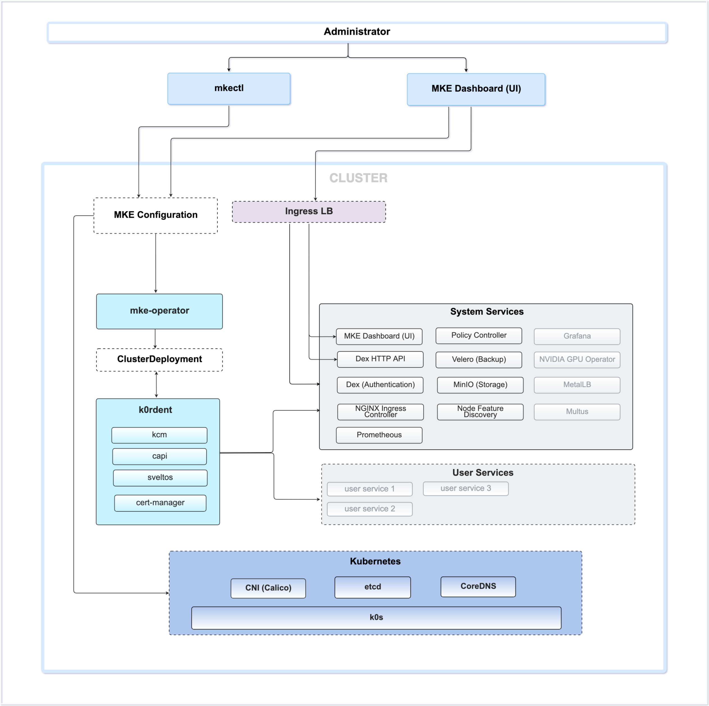

Mirantis Kubernetes Engine (MKE) 4k is an enterprise-grade, production-ready
Kubernetes platform that is designed to be secure, scalable, and reliable.

You can manage the entire MKE 4k cluster through the mke4.yaml configuration
file. Refer to [Configuration](../configuration) for details.

## Components

An MKE 4k cluster is comprised of the following components:

- k0s Kubernetes distribution
- Calico CNI
- MKE 4k Control Plane
- System and user services

### k0s
k0s is a lightweight and open-source Kubernetes distribution that acts as the foundational runtime for MKE 4k clusters. For more information, refer to the [k0s documentation](https://docs.k0sproject.io/stable//).

### Calico CNI

MKE 4k provides secure, scalable, policy-driven networking through the Calico container network interface (CNI).

The Calico configuration at installation is as follows:
- IPv4 only, with a fixed Pod CIDR of `192.168.0.0/16`
- Datastore mode set to `kdd`
- `kube-proxy` mode set to `iptables`
- A `vxlan` backend that uses the default port of `4789` for traffic and the default virtual network ID of `4096`

Refer to [Container Network Interface](../cni) for the network configuration details

### MKE 4k Control Plane

The MKE 4k Control Plane, which is comprised of 'mke-operator` and `kordent`, is used to orchestrate, manage, and maintain the lifecycle of the MKE 4k cluster and services.

- `mke-operator`: A Kubernetes-native operator that automates installation, upgrades, system configuration, and user services .
- `k0rdent`: An open-source component that performs lifecycle management for the services that `mke-operator` configures.

### System and User Services

The system and user services are Kubernetes workloads that run within the cluster, such as monitoring, logging, ingress, and user-defined applications.  Use the MKE 4 control plane to manage the deployment and lifecycle of these workloads.

The system and user services are Kubernetes workloads that run within the MKE 4k cluster. On the system side, these services include monitoring, logging, and ingress, among others. On the user side, the services are typically user-defined applications.  Using the MKE 4 control plane, you can manage the deployment and lifecycle of the various workloads.

## Architecture Diagram

<!-- ### Data Plane -->

<!-- [Discuss the data plane components and their functions] -->

<!-- ## High-Level Diagram -->

<!-- [Include a high-level diagram illustrating the MKE 4k architecture] -->

<!-- ## Deployment considerations -->

<!-- [Highlight any important considerations for deploying MKE 4k] -->

<!-- ## Conclusion [Wrap up the document with a conclusion or summary] -->

<!-- ### Control plane -->

<!-- [Discuss the control plane component and its function] -->
