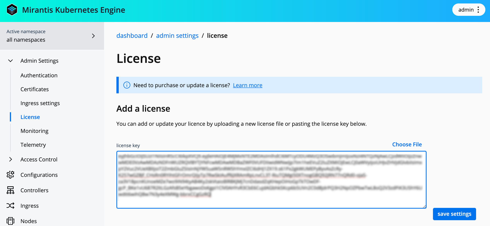

After you [Install the MKE image](install-MKE-CLI.md), proceed with downloading
your MKE license as described below. This section also contains steps to apply
your new license using the MKE web UI and configuration file.



Users are not authorized to run MKE without a valid license. For more
information, refer to [Mirantis Agreements and Terms](https://legal.mirantis.com/).



## Download your MKE license

1. Open an email from Mirantis Support with the subject Welcome to Mirantis’
   CloudCare Portal and follow the instructions for logging in.

2. If you did not receive the CloudCare Portal email, it is likely that you
   have not yet been added as a Designated Contact. To remedy this, contact
   your Designated Administrator.

3. In the top navigation bar, click **Environments**.

4. Click the **Cloud Name** associated with the license you want to download.

5. Scroll down to **License Information** and click the **License File URL**. 
   A new tab opens in your browser.

6. Click **View file** to download your license file.



Though MKE is generally a subscription-only service, Mirantis offers a free
trial license by request. Use our [contact form](https://www.mirantis.com/contact)
to request a free trial license.



## Set the license in MKE web UI

1. Log in to your MKE instance using an administrator account.

2. In the left panel, navigate to **Admin Settings** -> **License**. 
3. Paste the token as a string into a **license key** text box, or click
   **Choose File** and select a license key (.lic) file from a modal.

   

4. Click **Save settings**. MKE will automatically update with the new settings.

## Set the license in the configuration

1. Set the license token under ``spec.license.token`` in the MKE 4
   configuration file:

    ```yaml
    spec:
      license:
        token: <your-license-token>
    ```

2. Apply the license:

   ```commandline
   mkectl apply
   ```

3. Check the license status, users can see the status of the ``mkeconfig``
   resource:

   ```commandline
   kubectl -n mke get mkeconfig mke -ojsonpath="{.status.licenseStatus}" | jq 
   ```

   Example output:
   
   ```json
   {
     "expiration": "2027-10-10T07:00:00Z",
     "licenseType": "Offline",
     "maxEngines": 10,
     "scanningEnabled": true,
     "subject": "sf|0014W0000341gYFQAY|a2X4W000000ZeatUAC",
     "tier": "Production"
   }
   ```


