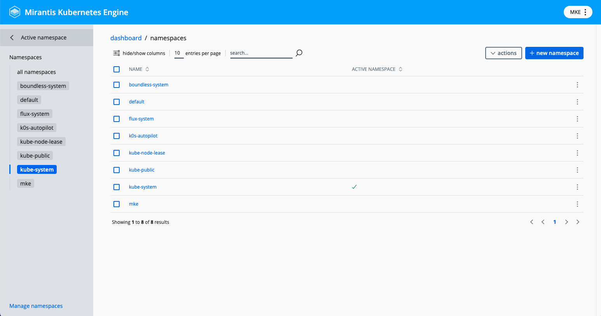

# MKE-Dashboard add-on for MKE

#### `v4.0.0-alpha.2.0` +

The MKE-Dashboard add-on provides a UI for kubernetes resource management. 

Future: User management and administrative configurations will also be possible through the dashboard.

## Installation

MKE-Dashboard comes installed on most clusters. To access MKE-Dashboard, visit the address of the load balancer endpoint on a freshly-installed cluster.

## 4.0.0-alpha.2.0 release

### What's included

- Metrics eg. node performance + usage statistics
- Basic kubernetes management of the following (View, Create, Update + Delete)
  - Configurations: ConfigMaps
  - Controllers: ReplicaSets, ReplicationControllers, StatefulSets, Jobs, CronJobs, Daemonsets + Deployments
  - Namespaces
  - Nodes
  - Pods
  - Services
  - ServiceAccounts
  - Storage: StorageClasses, PersistantVolumes + PersistantVolumeClaims
- View kubernetes resources by namespace, or all namespaces at once

### What's new

#### Namespace management

Namespaces can now be managed by clicking on the active namespace in the side menu. This opens the namespace selector.

From there, if you wish to manage your namespaces further (add, remove, etc), you can click on the "manage namespaces" button at the bottom left and this will open a list view of your namespaces.

To leave, simply click on the "dashboard" icon in the breadcrumb or the back arrow next to "active namespace" in the sidenav and this will return you to the main menu.

#### Sign out, MKE Version + documentation links

The MKE version is now indicated in a new menu at the top right of the dashboard.

Here you will also find links to documentation and the "sign out" option.

### Future

- User management
- User settings
- Admin settings: authentication, ingress, backups, certificates, telemetry + logging.
- Support bundle access
- App notifications + alerts
- Improved detail view of individual kubernetes resources
- Statuses for kubernetes objects
- ...and more
